# Model Routing Architecture for AI-Git-Bot

## Purpose

This document summarizes the proposed architecture for adding model routing to AI-Git-Bot.

The key idea is:

> A `RoutingAiClient` delegates workload calls to existing `AiIntegration` configurations.
> Before choosing the target integration, a workflow-specific routing analyzer may use a separately configured existing `AiIntegration` to reason about the task.
> The analyzer produces a generic `RoutingProfile`. A generic routing policy then maps that profile to the name of an existing AI integration.

The design intentionally separates:

1. **Task analysis** — What kind of reasoning/capabilities does this task require?
2. **Routing policy** — Which configured model should handle such a task?
3. **Execution** — Run the real workload with the selected `AiIntegration`.

This keeps routing generic while allowing different workflows to use different decision processes.

---

# Goals

The routing architecture should:

- reuse existing `AiIntegration` configurations;
- avoid duplicating provider/model configuration;
- keep workflows independent from provider-specific logic;
- allow workflow-specific reasoning before routing;
- allow different workflows to use different routing analysis;
- use an existing `AiIntegration` as the analysis/reasoning model;
- avoid recursive routing of the analysis request itself;
- preserve existing `AiClientFactory` caching, retry, and auditing;
- support per-call or per-phase model selection;
- preserve provider-native tool-call consistency;
- make routing decisions auditable and explainable;
- keep current bot behavior unchanged when routing is disabled.

---

# Non-goals

The first implementation does not need to provide:

- automatic cross-provider failover;
- dynamic load balancing;
- model benchmarking;
- autonomous model discovery;
- pricing optimization;
- context-window-aware routing;
- unrestricted model switching inside native tool-call conversations.

These can be added later.

---

# Core architectural principle

The router should not contain workflow-specific reasoning.

For example, the router itself should not need to understand:

- Git diffs;
- issue descriptions;
- implementation plans;
- documentation synchronization;
- test results;
- repository architecture.

Instead, workflows provide a workflow-specific **Routing Analyzer**.

The analyzer converts workflow-specific input into a normalized, workflow-independent `RoutingProfile`.

The routing policy operates only on that normalized profile.

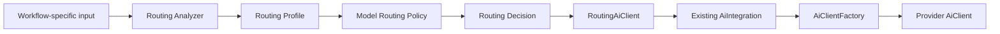

---

# Main components

## 1. RoutingAiClient

`RoutingAiClient` implements the existing `AiClient` interface.

Its job is infrastructure only:

1. obtain or build routing context;
2. invoke the appropriate analyzer;
3. obtain a `RoutingProfile`;
4. pass the profile to the routing policy;
5. resolve the selected existing `AiIntegration`;
6. obtain the actual client from `AiClientFactory`;
7. delegate the workload request.

It should not itself contain workflow-specific analysis logic.

Conceptually:

```java
public class RoutingAiClient implements AiClient {

    private final RoutingAnalyzerRegistry analyzerRegistry;
    private final ModelRoutingPolicy routingPolicy;
    private final AiIntegrationService integrationService;
    private final AiClientFactory aiClientFactory;

    // ...
}
```

High-level execution:

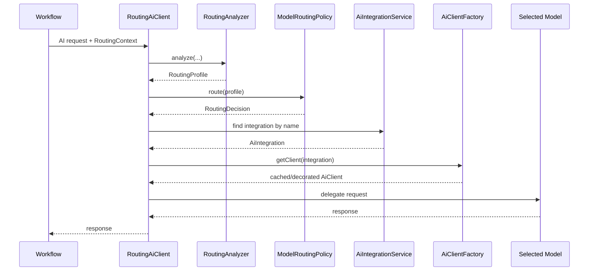

---

# 2. Existing AiIntegration remains the model configuration

Routing rules should reference existing AI integrations by name.

For example:

```text
qwen-router
qwen-local
claude-coding
claude-review
gpt-review
gemini-large-context
```

Each existing `AiIntegration` already contains the information needed to invoke the model:

- provider;
- model;
- API URL;
- credentials;
- max tokens;
- context-window size;
- model flavor;
- tool-calling options;
- provider-specific settings.

The routing system should not duplicate this configuration.

A routing rule should therefore look conceptually like:

```text
HIGH reasoning + SECURITY -> claude-review
```

not:

```text
HIGH reasoning + SECURITY ->
    provider=ANTHROPIC
    model=claude-...
    api-key=...
    context=...
```

---

# 3. Analysis Integration

In the normal case, determining the right routing profile requires reasoning.

To avoid the circular problem of:

> "Which model should reason about which model should reason about the task?"

the routing configuration explicitly references an existing `AiIntegration` for analysis.

Example:

```text
Routing Configuration:
    analysisIntegration = qwen-router
```

The analyzer resolves this integration **directly through `AiClientFactory`**.

It does not use `RoutingAiClient`.

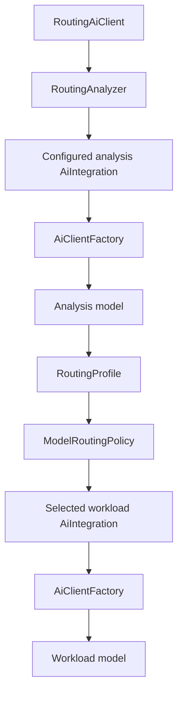

This makes the dependency acyclic.

The critical invariant is:

> The AI request used to analyze routing must bypass `RoutingAiClient`.

Conceptually:

```java
AiIntegration analysisIntegration =
    integrationService.findByName(
        routingConfiguration.getAnalysisIntegrationName()
    );

AiClient analysisClient =
    aiClientFactory.getClient(analysisIntegration);
```

Never:

```java
routingAiClient.analyze(...);
```

---

# 4. RoutingAnalyzer

Different workflows need different decision processes.

A code review may need to reason about:

- diff complexity;
- cross-file behavior;
- concurrency;
- authentication;
- authorization;
- migrations;
- API changes.

An issue implementation workflow may instead need to reason about:

- requirement clarity;
- architecture impact;
- repository exploration;
- number of likely tool calls;
- cross-module changes;
- implementation uncertainty.

A documentation workflow may need almost no semantic reasoning at all.

Therefore the architecture uses workflow-specific analyzers.

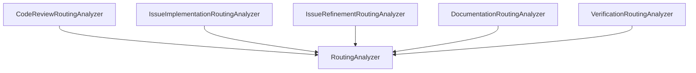

Possible interface:

```java
public interface RoutingAnalyzer<T extends RoutingAnalysisInput> {

    AiTask supports();

    RoutingProfile analyze(
        T input,
        RoutingAnalysisContext context
    );
}
```

The analyzer is responsible for:

- deciding what information is relevant;
- optionally extracting deterministic features first;
- deciding whether AI reasoning is necessary;
- constructing the analysis prompt;
- invoking the configured analysis integration;
- converting the result into a normalized `RoutingProfile`.

It does **not** choose a concrete model.

---

# 5. RoutingAnalyzerRegistry

`RoutingAiClient` should not contain a large switch statement.

A registry can select the analyzer for a given logical AI task.

```java
public enum AiTask {
    REVIEW,
    PLANNING,
    IMPLEMENTATION,
    VERIFICATION,
    REQUIREMENTS_REFINEMENT,
    DOCUMENTATION,
    SUMMARIZATION
}
```

Example registry:

```java
@Component
public class RoutingAnalyzerRegistry {

    private final Map<AiTask, RoutingAnalyzer<?>> analyzers;

    public RoutingAnalyzerRegistry(List<RoutingAnalyzer<?>> analyzers) {
        this.analyzers = analyzers.stream()
            .collect(Collectors.toMap(
                RoutingAnalyzer::supports,
                Function.identity()
            ));
    }

    public RoutingAnalyzer<?> get(AiTask task) {
        return analyzers.get(task);
    }
}
```

Adding a new workflow-specific analysis then means adding another analyzer instead of modifying the router.

---

# 6. RoutingProfile

Analyzers produce a generic profile.

Example:

```java
public record RoutingProfile(
    Complexity complexity,
    Risk risk,
    ContextRequirement contextRequirement,
    ReasoningRequirement reasoningRequirement,
    ToolRequirement toolRequirement,
    Set<String> capabilities,
    double confidence,
    Map<String, Object> attributes
) {}
```

Possible enums:

```java
enum Complexity {
    LOW,
    MEDIUM,
    HIGH
}

enum Risk {
    LOW,
    MEDIUM,
    HIGH
}

enum ContextRequirement {
    LOW,
    MEDIUM,
    HIGH
}

enum ReasoningRequirement {
    LOW,
    MEDIUM,
    HIGH
}

enum ToolRequirement {
    NONE,
    OPTIONAL,
    REQUIRED
}
```

The generic fields should describe **requirements of the task**, not model names.

Example:

```json
{
  "complexity": "HIGH",
  "risk": "HIGH",
  "contextRequirement": "MEDIUM",
  "reasoningRequirement": "HIGH",
  "toolRequirement": "REQUIRED",
  "capabilities": [
    "CODE",
    "SECURITY",
    "AUTHORIZATION"
  ],
  "confidence": 0.92
}
```

The analyzer must not return:

```json
{
  "model": "claude-review"
}
```

That decision belongs to the routing policy.

---

# 7. ModelRoutingPolicy

The policy maps a generic `RoutingProfile` to a configured integration.

Possible API:

```java
public interface ModelRoutingPolicy {

    RoutingDecision route(
        RoutingProfile profile,
        RoutingContext context
    );
}
```

Example result:

```java
public record RoutingDecision(
    String aiIntegrationName,
    String rule,
    boolean sticky
) {}
```

Example decision matrix:

```text
Priority 10
    capability contains SECURITY
    risk = HIGH
    -> claude-review

Priority 20
    reasoningRequirement = HIGH
    toolRequirement = REQUIRED
    -> claude-coding

Priority 30
    reasoningRequirement = MEDIUM
    -> qwen-local

Priority 40
    complexity = LOW
    -> cheap-local

Priority 999
    -> bot default integration
```

The policy is deterministic.

The model used for routing analysis determines **what the task requires**.

The policy determines **which model should satisfy those requirements**.

---

# Separation of responsibilities

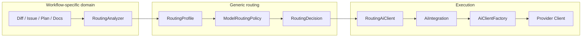

---

# Generic request context

`RoutingAiClient` should not infer the task type from prompt text.

The caller already knows what operation it is performing.

Instead, the request should contain explicit routing context.

Example:

```java
public record AiRoutingContext(
    AiTask task,
    String sessionId,
    RoutingAnalysisInput analysisInput
) {}
```

Possible sealed input hierarchy:

```java
public sealed interface RoutingAnalysisInput {
}
```

```java
public record ReviewRoutingInput(
    String diff,
    String title,
    String description
) implements RoutingAnalysisInput {
}
```

```java
public record ImplementationRoutingInput(
    String issueTitle,
    String issueBody,
    String planningContext
) implements RoutingAnalysisInput {
}
```

```java
public record DocumentationRoutingInput(
    String requestedChange,
    String currentDocument
) implements RoutingAnalysisInput {
}
```

This keeps workflow semantics out of `RoutingAiClient`.

---

# Review example

For code review, the relevant input is primarily the diff.

The review analyzer may use deterministic extraction first:

```java
public record DiffFacts(
    int filesChanged,
    int linesAdded,
    int linesDeleted,
    int hunks,
    Set<String> languages,
    Set<String> paths,
    boolean touchesTests,
    boolean touchesDocumentation,
    boolean touchesBuildFiles,
    boolean touchesDependencies,
    boolean touchesDatabaseMigration,
    boolean touchesSecuritySensitivePaths
) {}
```

Then, where necessary, semantic reasoning is used.

Example:

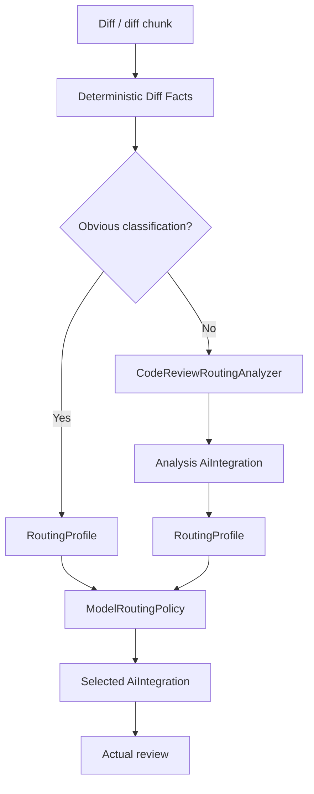

Example easy change:

```text
README.md
+20 / -4
No source files
```

Possible profile:

```text
complexity           = LOW
risk                 = LOW
reasoningRequirement = LOW
toolRequirement      = NONE
capabilities         = DOCUMENTATION
confidence           = 0.99
```

Possible route:

```text
cheap-local
```

Example harder change:

```text
AuthenticationFilter.java
SecurityConfiguration.java
TokenService.java
UserRepository.java
migration.sql
```

Possible profile:

```text
complexity           = HIGH
risk                 = HIGH
reasoningRequirement = HIGH
contextRequirement   = HIGH
capabilities         = CODE, SECURITY, AUTHORIZATION, DATABASE
confidence           = 0.91
```

Possible route:

```text
claude-review
```

---

# PR-level and chunk-level review analysis

Review routing may be performed at more than one scope.

## PR-level

Classify the complete change once.

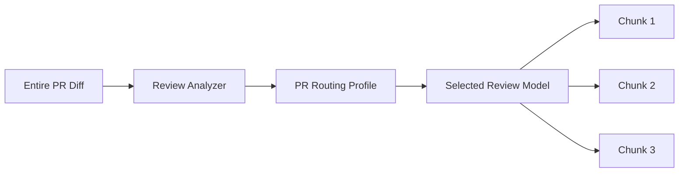

Advantages:

- cheap;
- consistent;
- simple.

Disadvantage:

- one difficult file can force the strongest model for all chunks.

## Chunk-level

Classify each semantic chunk separately.

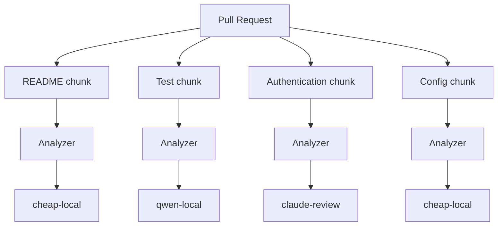

This provides better cost optimization.

## Combined approach

A later version can combine both.

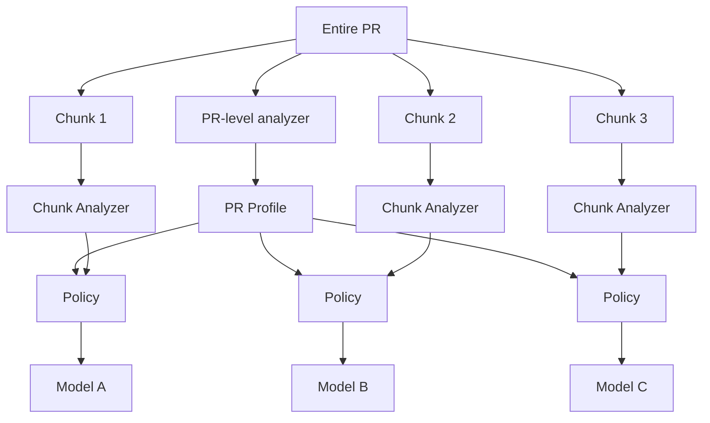

Example policy:

```text
Chunk complexity = LOW
but PR risk = HIGH
    -> do not use cheapest model
```

---

# Issue implementation example

Issue implementation has a different analysis process.

Relevant questions may include:

- how clear is the requirement?
- how much repository exploration is necessary?
- is architecture reasoning required?
- is this likely a localized change?
- is it cross-module?
- how many tool interactions are expected?
- does it require substantial implementation reasoning?

Example:

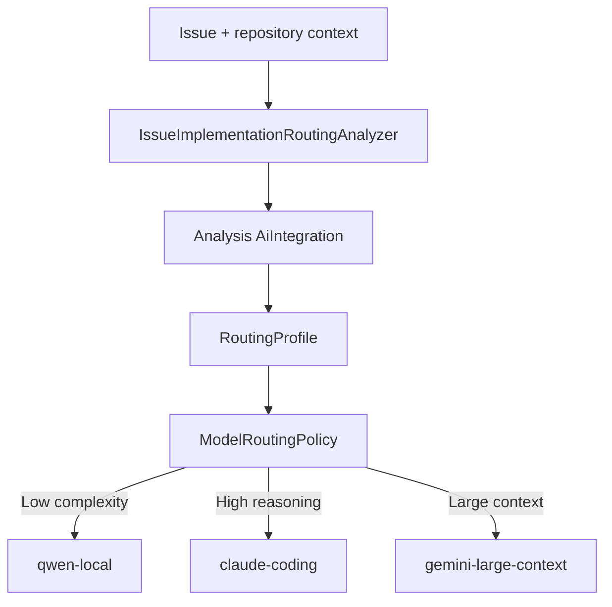

Example trivial issue:

```text
"Fix typo in README."
```

Possible analyzer result:

```text
complexity           = LOW
reasoningRequirement = LOW
contextRequirement   = LOW
toolRequirement      = OPTIONAL
capabilities         = DOCUMENTATION
```

Possible route:

```text
qwen-local
```

Example complex issue:

```text
"Replace the current authentication mechanism with OIDC,
while preserving API-token authentication and existing
repository-level authorization."
```

Possible profile:

```text
complexity           = HIGH
risk                 = HIGH
reasoningRequirement = HIGH
contextRequirement   = HIGH
toolRequirement      = REQUIRED
capabilities         = CODE, ARCHITECTURE, AUTHENTICATION, AUTHORIZATION
```

Possible route:

```text
claude-coding
```

---

# Multi-phase implementation workflow

A workflow may require different models at different logical phases.

Example:

```mermaid
flowchart LR
    I[Issue]
    I --> PA[Planning Analyzer]
    PA --> PP[Planning Profile]
    PP --> PM[Planning Model]

    PM --> PLAN[Implementation Plan]

    PLAN --> IA[Implementation Analyzer]
    IA --> IP[Implementation Profile]
    IP --> IM[Implementation Model]

    IM --> CODE[Changed Code]

    CODE --> VA[Verification Analyzer]
    VA --> VP[Verification Profile]
    VP --> VM[Verification Model]
```

Example result:

```text
Planning       -> qwen-local
Implementation -> claude-coding
Verification   -> gpt-review
```

The routing decision should usually remain stable inside one logical agent phase.

---

# Documentation workflow example

Documentation may require a different analyzer again.

Possible signals:

- amount of source material;
- whether source code must be inspected;
- whether multiple documents must be synchronized;
- whether the task is a trivial rewrite;
- required context size.

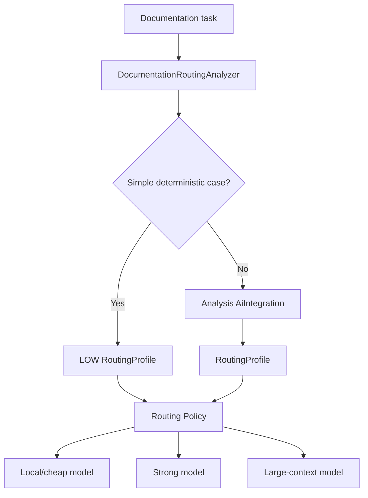

A simple Markdown rewrite may need no analyzer call at all.

A repository-wide README synchronization may require:

```text
contextRequirement   = HIGH
reasoningRequirement = MEDIUM
toolRequirement      = REQUIRED
capabilities         = DOCUMENTATION, REPOSITORY_ANALYSIS
```

---

# Issue refinement example

Issue refinement has yet another decision process.

Relevant questions may include:

- ambiguity;
- missing acceptance criteria;
- missing technical constraints;
- required repository knowledge;
- architectural implications;
- whether code inspection is required.

Example:

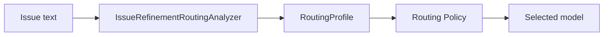

Example vague issue:

```text
"Add caching to improve performance."
```

Possible profile:

```text
complexity           = MEDIUM
reasoningRequirement = MEDIUM
contextRequirement   = MEDIUM
toolRequirement      = OPTIONAL
capabilities         = REQUIREMENTS, ARCHITECTURE
```

A stronger model may be selected if repository inspection is required.

---

# Hybrid analysis

Not every routing decision needs an AI reasoning call.

Analyzers may combine:

- deterministic heuristics;
- static features;
- task metadata;
- AI-based reasoning.

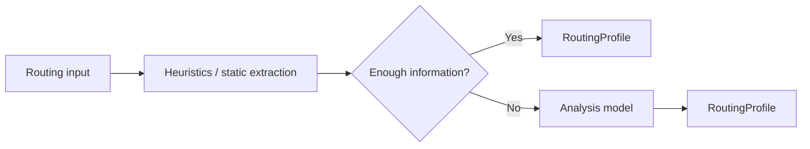

Examples where analysis can often be skipped:

- only Markdown changed;
- tiny typo fix;
- known generated file;
- simple summarization below a token threshold;
- deterministic configuration-only update.

Examples where reasoning is appropriate:

- concurrency changes;
- security-sensitive code;
- architecture changes;
- vague implementation requirements;
- cross-module refactoring;
- unfamiliar repository changes.

---

# Analyzer model output

The analyzer model should not solve the task itself.

For review, do not ask:

> Find all defects in this change.

Ask:

> Classify the reasoning requirements of this change. Do not review the implementation and do not propose fixes.

Example structured output:

```json
{
  "complexity": "HIGH",
  "risk": "HIGH",
  "reasoningRequirement": "HIGH",
  "contextRequirement": "MEDIUM",
  "toolRequirement": "OPTIONAL",
  "capabilities": [
    "CODE",
    "CONCURRENCY"
  ],
  "confidence": 0.91
}
```

The output should be:

- short;
- structured;
- schema validated;
- constrained to known enum values;
- independent from concrete integration names.

---

# Confidence handling

Routing analysis is probabilistic.

A low-confidence result should not route to a weaker model merely because one class narrowly won.

Example:

```text
LOW     0.36
MEDIUM  0.34
HIGH    0.30
```

The system should behave conservatively.

Possible policy:

```text
confidence >= 0.80
    -> use normal routing matrix

confidence < 0.80
    -> use bot default or configured conservative integration
```

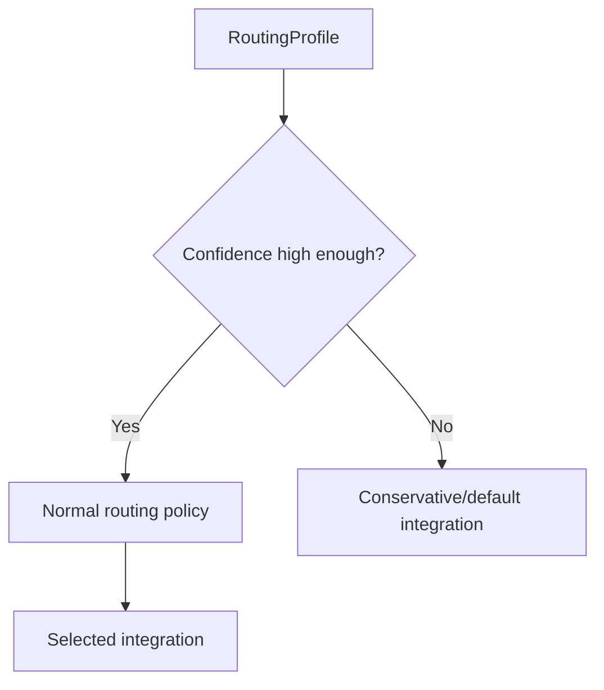

A later version could support analyzer escalation:

```text
cheap analyzer
    ↓
low confidence
    ↓
strong analyzer
    ↓
RoutingProfile
```

but this is not necessary for V1.

---

# Analysis failure handling

The routing layer must not become a single point of failure.

If analysis fails because of:

- timeout;
- provider error;
- invalid structured output;
- missing analysis integration;
- parse failure;

the system should use a safe fallback.

Recommended V1 behavior:

```text
analysis succeeds
    -> normal routing policy

analysis fails
    -> bot default AiIntegration
```

Optionally a routing configuration may specify a dedicated fallback integration.

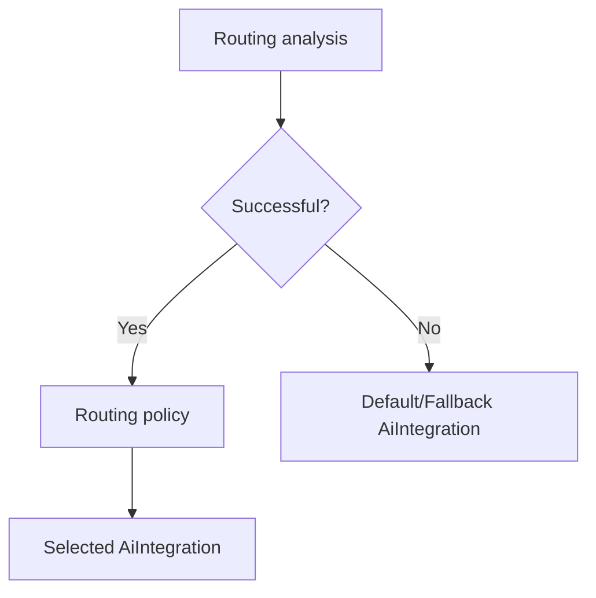

---

# Routing scope

The analyzer should not normally run before every tool-loop iteration.

That would double the number of AI calls and could cause model changes during provider-native tool conversations.

Routing should operate at meaningful scopes.

Possible scopes:

```java
public enum RoutingScope {
    REQUEST,
    WORK_ITEM,
    PHASE,
    SESSION
}
```

Examples:

```text
Code review:
    diff chunk -> REQUEST

Implementation:
    planning -> PHASE
    implementation -> PHASE
    verification -> PHASE

Agentic implementation tool loop:
    selected model remains sticky for PHASE or SESSION
```

---

# Native tool-call stickiness

Provider-native tool calls may contain provider-specific state.

For example:

```text
Round 1
    Gemini
    -> function call
    -> provider-specific metadata

Tool executes

Round 2
    must return tool result to Gemini
```

Switching to another provider before the tool exchange completes is unsafe.

Therefore:

> An active provider-native tool-call exchange must remain on the same selected `AiIntegration`.

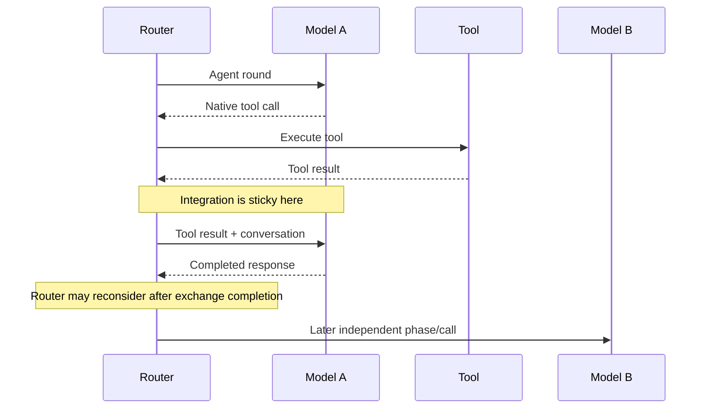

For V1, the simplest safe rule is:

> If an agent uses native tool calling, keep the selected integration sticky for the entire `AgentLoop`.

This can be relaxed later.

---

# Legacy tool calling

Text-based/legacy tool calling is less provider-specific.

Conceptually:

```text
Model A
    -> textual tool request

tool executes

Model B
    -> continues from textual history
```

This makes model changes technically easier.

However, per-round routing is still not necessarily desirable because:

- reasoning style changes;
- context interpretation changes;
- model capabilities differ;
- repeated analysis increases cost.

Therefore phase-level stickiness is still a good default.

---

# Token and context-window handling

The selected `AiIntegration` owns:

- context-window size;
- max token settings;
- model flavor;
- tool capability settings.

Code that currently resolves these properties once before execution must be reviewed when introducing routing.

The system must not calculate token budgets from one integration and execute against another.

Longer-term, these values can also become routing inputs.

Example future routing:

```text
estimated context = 118k

qwen-local:
    max context 64k
    -> reject candidate

claude-large:
    max context 200k
    -> eligible

gemini-large:
    max context 1m
    -> eligible
```

For V1, context-aware routing is optional, but execution must remain correct.

---

# Routing decision caching

Routing analysis may be cached for a meaningful content scope.

Example key:

```java
public record RoutingAnalysisKey(
    AiTask task,
    String scopeId,
    String contentHash
) {}
```

Review example:

```text
task        = REVIEW
scopeId     = pr-391-chunk-3
contentHash = SHA256(diff)
```

If the same content is processed again:

```text
reuse RoutingProfile
```

If the diff changes:

```text
content hash changes
    -> analyze again
```

Implementation example:

```text
task        = IMPLEMENTATION
scopeId     = workflowRunId + ":implementation"
contentHash = SHA256(issue + plan + relevant context)
```

Caching is optional for V1 but is a useful optimization.

---

# Configuration model

A reusable routing configuration could look conceptually like:

```yaml
name: code-routing

analysisIntegration: qwen-router

defaultIntegration: claude-sonnet

confidenceThreshold: 0.80

rules:
  - priority: 10
    when:
      risk: HIGH
      capabilities:
        contains: SECURITY
    target: claude-review

  - priority: 20
    when:
      reasoningRequirement: HIGH
      toolRequirement: REQUIRED
    target: claude-coding

  - priority: 30
    when:
      reasoningRequirement: MEDIUM
    target: qwen-local

  - priority: 40
    when:
      complexity: LOW
    target: cheap-local
```

The important part is that all target values are names of existing AI integrations.

---

# Suggested persistence model

Conceptually:

```text
model_routing_configuration
---------------------------
id
name
description
analysis_ai_integration_id
default_ai_integration_id
confidence_threshold
created_at
updated_at
```

```text
model_routing_rule
------------------
id
configuration_id
priority
conditions
target_ai_integration_id
enabled
```

The exact rule representation can initially be JSON if the set of conditions is expected to evolve quickly.

Alternatively, strongly typed columns can be introduced once the routing profile schema stabilizes.

---

# Bot relationship

A bot can keep its existing default `AiIntegration`.

Routing configuration should be optional.

Conceptually:

```text
Bot
    default AiIntegration
    optional ModelRoutingConfiguration
```

Behavior:

```text
routing configuration absent
    -> current behavior
    -> use bot.aiIntegration

routing configuration present
    -> use RoutingAiClient
```

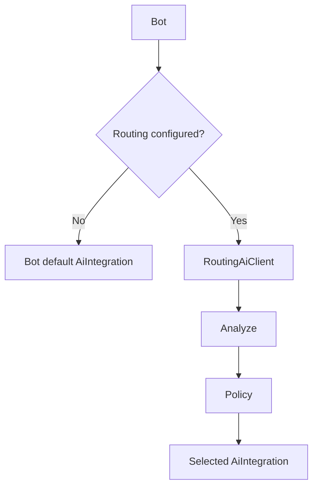

This preserves backward compatibility.

---

# AiClientFactory remains authoritative

`AiClientFactory` should continue to be responsible for:

- constructing provider clients;
- caching them;
- decorating them;
- retry behavior;
- auditing.

The router should not duplicate those responsibilities.

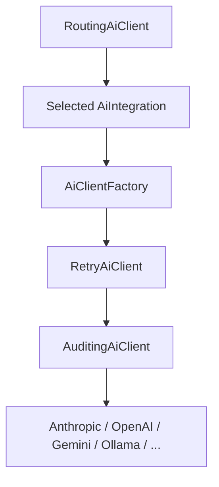

A new routing decision may happen for every allowed scope.

A new physical provider client usually does not need to be created because the factory cache can return an existing one.

---

# Why not clone AiIntegration per call?

A routing decision should resolve an existing integration.

Preferred:

```java
AiIntegration target =
    integrationService.findByName(decision.aiIntegrationName());

AiClient delegate =
    aiClientFactory.getClient(target);
```

Avoid:

```java
AiIntegration temporary = new AiIntegration();
// copy properties from selected integration
```

Reasons:

- existing configuration should remain the source of truth;
- factory caching should continue to work;
- audit attribution should use the real integration;
- updates to integrations should automatically affect routing;
- entity identity should not be blurred by temporary clones.

The per-call object should be a `RoutingDecision`, not a cloned integration.

---

# Example end-to-end: code review

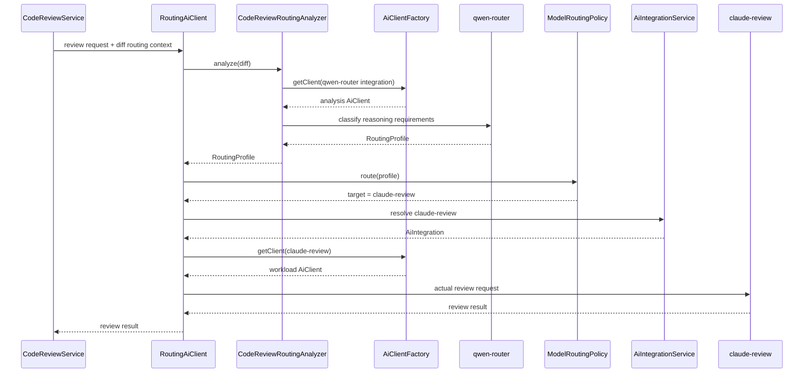

---

# Example end-to-end: issue implementation

```mermaid
sequenceDiagram
    participant W as Implementation Workflow
    participant R as RoutingAiClient
    participant A as ImplementationRoutingAnalyzer
    participant AM as Analysis Model
    participant P as Routing Policy
    participant M as Coding Model

    W->>R: implementation request + issue/repo context
    R->>A: analyze implementation task
    A->>AM: classify complexity/context/tool needs
    AM-->>A: RoutingProfile
    A-->>R: RoutingProfile

    R->>P: route(profile)
    P-->>R: claude-coding

    R->>M: execute implementation phase

    loop agent/tool rounds
        M-->>R: tool call
        R->>M: tool result
    end

    M-->>R: completed implementation result
    R-->>W: result
```

The selected integration remains sticky during the agent/tool loop.

---

# Example end-to-end: documentation

```mermaid
sequenceDiagram
    participant W as Documentation Workflow
    participant R as RoutingAiClient
    participant A as DocumentationRoutingAnalyzer
    participant P as Routing Policy
    participant M as Selected Model

    W->>R: documentation request
    R->>A: analyze task

    alt trivial deterministic case
        A-->>R: LOW RoutingProfile
    else semantic analysis required
        A-->>R: analyzed RoutingProfile
    end

    R->>P: route(profile)
    P-->>R: selected integration

    R->>M: execute documentation task
    M-->>R: result
    R-->>W: result
```

---

# Auditing

Routing should be explainable.

Example routing audit record:

```text
sessionId           = workflow-run-123
task                = REVIEW
scope               = REQUEST
analyzer             = CodeReviewRoutingAnalyzer
analysisIntegration  = qwen-router

profile:
    complexity           = HIGH
    risk                 = HIGH
    reasoningRequirement = HIGH
    contextRequirement   = MEDIUM
    capabilities         = SECURITY, CODE
    confidence           = 0.91

routing:
    matchedRule          = high-risk-security
    selectedIntegration  = claude-review
    sticky               = false
```

For agentic implementation:

```text
task                = IMPLEMENTATION
scope               = PHASE
matchedRule         = high-reasoning-tools
selectedIntegration = claude-coding
sticky              = true
```

---

# Metrics

Possible routing metrics:

```text
model_router_decisions_total{
    task="review",
    integration="claude-review",
    rule="high-risk-security"
}
```

```text
model_router_analysis_total{
    analyzer="CodeReviewRoutingAnalyzer",
    analysis_integration="qwen-router"
}
```

```text
model_router_analysis_failures_total{
    reason="timeout"
}
```

```text
model_router_fallback_total{
    reason="low-confidence"
}
```

```text
model_router_profile_confidence
```

Existing AI usage metrics should continue to identify the actual selected `AiIntegration`.

Metrics should not report `RoutingAiClient` as if it were the real AI provider.

---

# Recommended V1

A first implementation can stay relatively small.

## V1 components

```text
RoutingAiClient
RoutingAnalyzer
RoutingAnalyzerRegistry
RoutingProfile
ModelRoutingPolicy
RoutingDecision
ModelRoutingConfiguration
```

## V1 behavior

1. Bot optionally references a routing configuration.
2. Routing configuration references:
   - one existing analysis `AiIntegration`;
   - one default integration;
   - routing rules.
3. Workflow provides:
   - `AiTask`;
   - workflow-specific `RoutingAnalysisInput`.
4. Analyzer may:
   - use deterministic shortcuts;
   - otherwise call the configured analysis integration.
5. Analyzer returns a structured `RoutingProfile`.
6. Policy selects an existing `AiIntegration` by name/ID.
7. `RoutingAiClient` gets the delegate through `AiClientFactory`.
8. Actual workload call is executed.
9. Native-tool agent phases are sticky to one integration.
10. Analyzer failures and low confidence use the default integration.

---

# Suggested implementation sequence

## Step 1 — Routing SPI

Introduce:

```text
RoutingProfile
RoutingDecision
ModelRoutingPolicy
AiRoutingContext
RoutingAnalysisInput
```

No behavior change yet.

## Step 2 — RoutingAiClient

Implement delegation to an existing `AiIntegration`.

Initially use the bot's default integration for every request.

This proves that the wrapper can be inserted without changing behavior.

## Step 3 — Routing configuration

Add:

```text
analysis integration
default integration
confidence threshold
rules
```

Reference existing `AiIntegration` records.

## Step 4 — Analyzer SPI and registry

Introduce:

```text
RoutingAnalyzer
RoutingAnalyzerRegistry
```

Start with one workflow, probably code review.

## Step 5 — AI-based analysis

Use the configured analysis integration directly through `AiClientFactory`.

Require structured output.

Add fallback behavior.

## Step 6 — Add more analyzers

Examples:

```text
CodeReviewRoutingAnalyzer
IssueImplementationRoutingAnalyzer
IssueRefinementRoutingAnalyzer
DocumentationRoutingAnalyzer
VerificationRoutingAnalyzer
```

## Step 7 — Tool-call stickiness

Ensure that agentic/native-tool phases keep the selected integration for the required scope.

## Step 8 — Observability

Add:

- routing audit events;
- matched rule;
- analyzer integration;
- selected workload integration;
- confidence;
- fallback reason;
- routing metrics.

---

# Important invariants

## Invariant 1

The analyzer determines task requirements.

It does not select concrete models.

```text
Analyzer:
    "HIGH reasoning, HIGH risk, SECURITY"

not:

    "Use Claude"
```

## Invariant 2

The routing policy selects models.

It does not understand workflow-specific domain details.

```text
Policy:
    HIGH risk + SECURITY -> claude-review
```

It should not parse Git diffs.

## Invariant 3

The analysis integration is an existing `AiIntegration`.

No separate AI-provider configuration mechanism is required.

## Invariant 4

The analysis call bypasses `RoutingAiClient`.

This prevents recursion.

## Invariant 5

The selected workload model is also an existing `AiIntegration`.

## Invariant 6

`AiClientFactory` remains responsible for actual client construction, caching, retry, and auditing.

## Invariant 7

Provider-native tool-call exchanges cannot switch integration in the middle of an active exchange.

## Invariant 8

Routing failures fall back safely to the configured/default integration.

## Invariant 9

Existing bots without routing enabled continue behaving exactly as before.

---

# Final architecture

```mermaid
flowchart TB
    subgraph WorkflowLayer["Workflow Layer"]
        W[Workflow]
        RC[AiRoutingContext]
        W --> RC
    end

    subgraph AnalysisLayer["Routing Analysis Layer"]
        REG[RoutingAnalyzerRegistry]
        AN[Workflow-specific RoutingAnalyzer]
        FACTS[Optional deterministic feature extraction]
        AINT[Configured Analysis AiIntegration]
        AF1[AiClientFactory]
        AM[Analysis Model]

        RC --> REG
        REG --> AN
        AN --> FACTS
        FACTS --> AINT
        AINT --> AF1
        AF1 --> AM
    end

    AM --> RP[RoutingProfile]

    subgraph PolicyLayer["Generic Routing Policy"]
        POL[ModelRoutingPolicy]
        RD[RoutingDecision]
        RP --> POL
        POL --> RD
    end

    subgraph ExecutionLayer["Workload Execution"]
        RAC[RoutingAiClient]
        WINT[Selected Existing AiIntegration]
        AF2[AiClientFactory]
        RETRY[Retry / Audit Decorators]
        MODEL[Provider Model]

        RD --> RAC
        RAC --> WINT
        WINT --> AF2
        AF2 --> RETRY
        RETRY --> MODEL
    end

    MODEL --> RESULT[Workflow Result]
```

---

# Summary

The proposed architecture is based on four clear responsibilities:

```text
RoutingAnalyzer
    -> What does this task require?

Analysis AiIntegration
    -> Reason about the task when semantic analysis is necessary.

ModelRoutingPolicy
    -> Which configured model satisfies those requirements?

RoutingAiClient
    -> Execute the workload through the selected integration.
```

Different workflows can therefore use completely different decision processes while sharing the same routing mechanism.

Code review can reason about a diff.

Issue implementation can reason about requirements and repository complexity.

Documentation can reason about context size and repository inspection requirements.

Issue refinement can reason about ambiguity and missing information.

All of them eventually produce the same generic `RoutingProfile`, which keeps the routing policy independent from workflow semantics.

The use of an existing `AiIntegration` for analysis solves the bootstrap/recursion problem cleanly and reuses the existing provider configuration, caching, retry, and auditing infrastructure.
